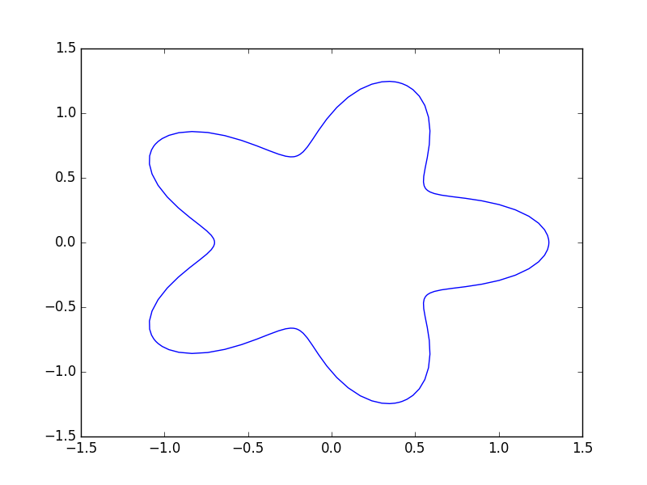

=================
Introduction
=================

This is an example code to show how the errors decrease with the use of special quadrature. We use a toy example of a starfish-shaped domain defined as 

.. math::

	\tau = (1+0.3\cdot\cos(5t))\cdot\exp(it)

with a parametrization between :math:`t\in[0,2\pi]`. This is represented in complex notation. 

The interface is discretized with 16-point Gauss-Legendre quadrature on panels of equal arc-length.